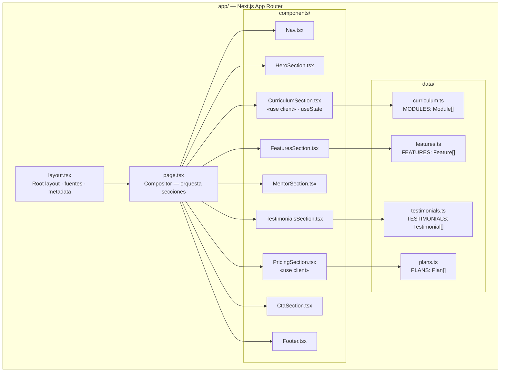
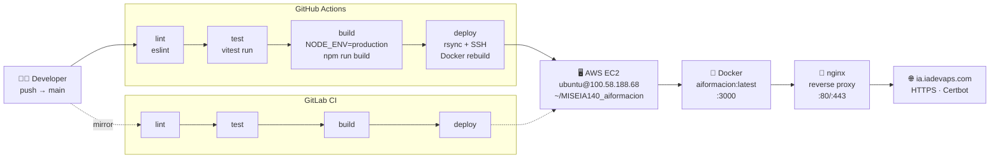
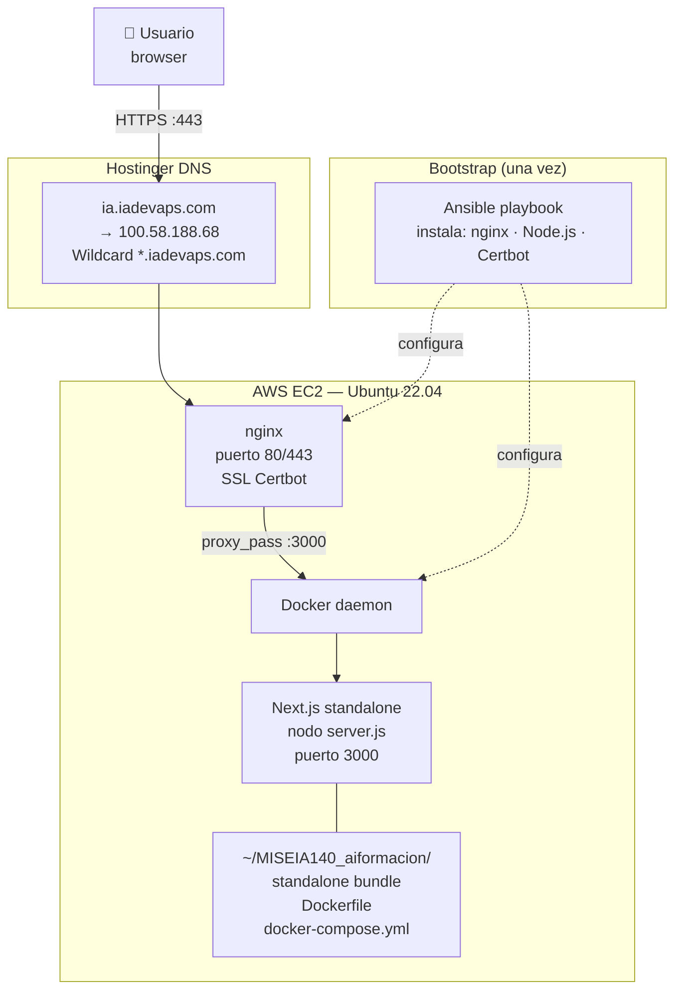

# Arquitectura del Sistema — AIFormación

## 1. Arquitectura de la Aplicación

La aplicación sigue la estructura del App Router de Next.js con separación por capas: datos, componentes de sección y página compositor.

| Componente | Tipo | Responsabilidad |
|------------|------|-----------------|
| `layout.tsx` | Server | Fuentes Google, metadata SEO, HTML root |
| `page.tsx` | Server | Compositor puro — 20 líneas |
| `CurriculumSection` | Client | Estado del acordeón (`useState`) |
| `HeroSection` | Client | Hover handlers en botones |
| `PricingSection` | Client | Hover handlers en botones de plan |
| `data/*.ts` | — | Constantes tipadas, sin lógica |

---

## 2. Flujo CI/CD

Dos pipelines activos: GitHub Actions (principal) y GitLab CI/CD (espejo).

**Stages del pipeline:**

| Stage | Herramienta | Condición |
|-------|-------------|-----------|
| lint | ESLint + eslint-config-next | Todo push |
| test | Vitest run (20 tests) | Todo push |
| build | Next.js standalone, `NODE_ENV=production` | Tras lint+test |
| deploy | rsync + SSH + Docker compose | Solo branch `main` |

---

## 3. Stack de Infraestructura

**Componentes de infraestructura:**

| Componente | Tecnología | Versión | Propósito |
|------------|------------|---------|-----------|
| VM | AWS EC2 Ubuntu | 22.04 LTS | Host principal |
| Contenedor | Docker | 24+ | Aislamiento del proceso Node.js |
| Orquestación | docker-compose | v2 | Gestión del ciclo de vida |
| Proxy | nginx | 1.24+ | TLS termination + reverse proxy |
| SSL | Certbot / Let's Encrypt | — | Certificado wildcard `*.iadevaps.com` |
| DNS | Hostinger | — | Dominio `ia.iadevaps.com` → `100.58.188.68` |
| Aprovisionamiento | Ansible | 2.x | Bootstrap idempotente del servidor |
| Runtime | Node.js | 24 LTS | Ejecución de Next.js standalone |
