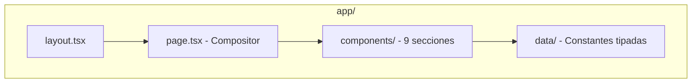
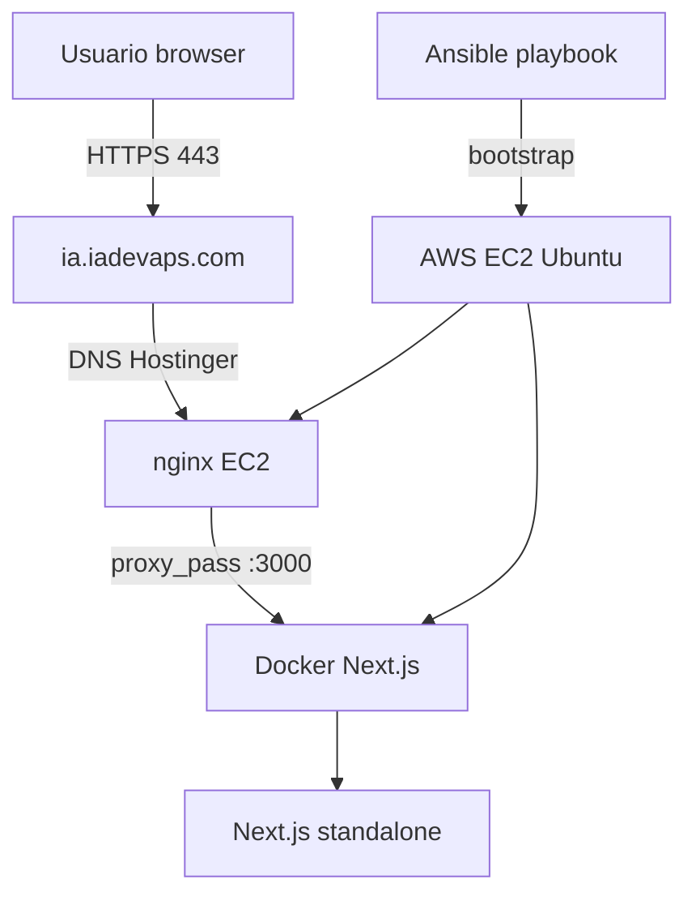

@~/.claude/prompts/new_functionality_prompt_spec.md

# Crear Diagrama de Arquitectura del Sistema

## Role
Act as a Software Architect with expertise in Next.js, AWS EC2, Docker, nginx, GitHub Actions, and technical documentation with Mermaid diagrams.

## Context
Proyecto: **1-5-40-nextjs-gh-aws** — AIFormación landing page.

**Arquitectura del sistema (tras completar T3 y T4):**
- **Código:** Next.js 16.2.4 standalone + TypeScript, en repositorio `Jorgeaapaz/gh-aws`
- **CI/CD:** GitHub Actions (lint → test → build → deploy) + GitLab CI/CD
- **Infraestructura:** AWS EC2 Ubuntu `100.58.188.68`
- **Contenedor:** Docker (Next.js standalone, puerto 3000)
- **Proxy:** nginx con SSL/TLS, dominio `ia.iadevaps.com`
- **DNS:** Hostinger, wildcard `*.iadevaps.com`
- **Configuración:** Ansible (`inventory.ini` + `playbook.yml`) para bootstrap del servidor

**Issues corregidos:** `dc_diagrama_arquitectura`

## Task
Crear un fichero `docs/architecture.md` con diagramas Mermaid que documenten la arquitectura completa del sistema: componentes de la aplicación, flujo CI/CD, y stack de infraestructura.

### Diagrama Guidelines

**Diagrama 1: Arquitectura de componentes (tras refactor T3)**

**Diagrama 2: Flujo CI/CD**

```mermaid
graph LR
  DEV[Developer push main] --> GH[GitHub Actions]
  GH --> LINT[1. Lint]
  LINT --> TEST[2. Test + Coverage]
  TEST --> BUILD[3. Build NODE_ENV=production]
  BUILD --> DEPLOY[4. SSH Deploy to EC2]
  DEPLOY --> VM[Ubuntu 100.58.188.68]
  VM --> DOCKER[Docker container :3000]
  DOCKER --> NGINX[nginx reverse proxy]
  NGINX --> DOMAIN[ia.iadevaps.com HTTPS]
```

**Diagrama 3: Stack de infraestructura**

El fichero `docs/architecture.md` debe incluir:
1. Sección "Arquitectura de la Aplicación" con descripción y Diagrama 1
2. Sección "Flujo CI/CD" con descripción y Diagrama 2
3. Sección "Stack de Infraestructura" con descripción y Diagrama 3
4. Tabla de componentes: servicio, tecnología, versión, propósito

Actualizar el `README.md` para añadir un link a `docs/architecture.md`.

## Output format
- `docs/architecture.md` con los 3 diagramas Mermaid
- `README.md` actualizado con link al diagrama

## Examples and Steps to follow

1. Revisar la estructura de ficheros actual (tras T3 si está completo, o con la estructura original)
2. Revisar `.github/workflows/deploy.yml` para el flujo CI/CD
3. Revisar `scripts/setup-ec2.sh` y `D:\Master-IA-Dev\05-Bloque5\1-5-30-ansible-aws\ansible\playbook.yml`
4. Crear `docs/architecture.md` con los 3 diagramas
5. Añadir link en `README.md` en la sección de Arquitectura (o crear esa sección)

## Output checklist and Guardrails

- [ ] `docs/architecture.md` existe con 3 secciones y 3 diagramas Mermaid
- [ ] Los diagramas son sintácticamente correctos (validar en mermaid.live)
- [ ] El diagrama de CI/CD refleja los stages reales del workflow
- [ ] La tabla de componentes está completa
- [ ] El `README.md` tiene un link a `docs/architecture.md`
- [ ] Los nombres en los diagramas coinciden con los ficheros/servicios reales del proyecto
